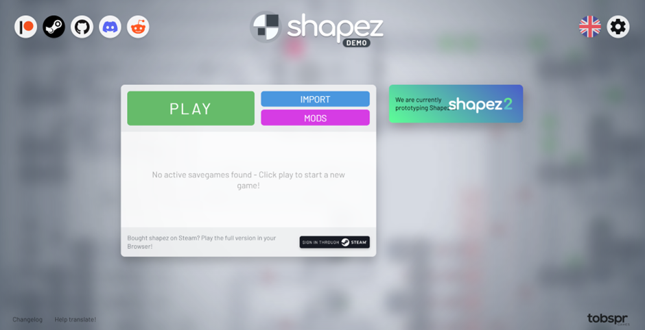
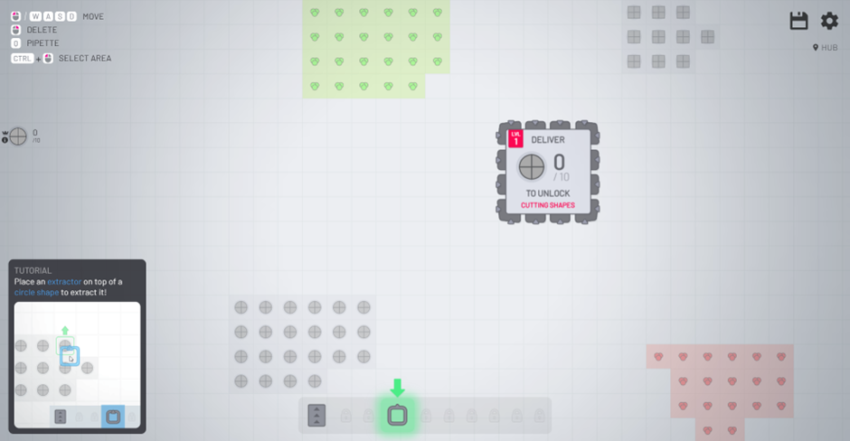

# Shapez

# Preview



# Run with Docker
```bash
docker build -t shapez-app .
docker run -it --rm -p 3001:3001 -p 3005:3005 shapez-app
```
<p>Akses Game client : localhost:3005</p>
<p>Akses Dashboard : locahost:3001</p>
